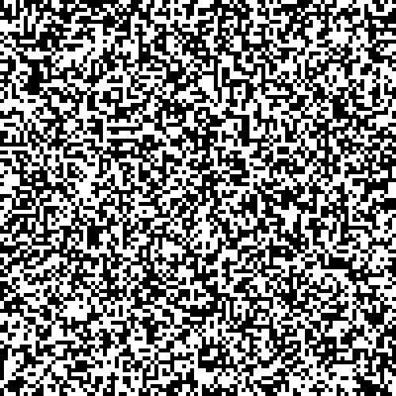
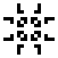
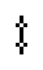

# conway
👾 Conway's Game of Life implemented in Erlang.



# Build
You'll need an Erlang installation, including `rebar3`.

```bash
$ rebar3 escriptize
```

A bit of the image processing is shunted to Haskell. You don't have to build
this yourself if you don't want to.

```bash
$ ghc -O2 renderFrame/render.hs 
```

# Run

```bash
$ _build/default/bin/conway <pattern_name>
$ _build/default/bin/conway pulsar         # for example
```

Writes out to `/tmp/conway/gif.gif` by default.

# Default Oscillators
I stole a bunch of Oscillators from the
[Wikipedia](https://en.wikipedia.org/wiki/Conway%27s_Game_of_Life#Examples_of_patterns)
article on the subject. You can call them by name as the first argument to the
`conway` executable under **Run**. They are:
  - `blinker`  
  
  - `toad`  
  
  - `beacon`  
  
  - `pulsar`  
  
  - `pentadecathlon`  
  
  - `random` (seen at the top of the page)

# Making A Pattern
To run your own simulation, you might edit `src/conway.erl` and add your own
case under `main()`. Here's the full definition for `blinker`:
```erlang
"blinker" -> board:init( [0,0,0,0,0
                         ,0,0,1,0,0
                         ,0,0,1,0,0
                         ,0,0,1,0,0
                         ,0,0,0,0,0], 2, {5,5});
```
Or, in general,
```
"<title>" -> board:init( [<starting_state>]
                       , <frames_to_draw>
                       , {<width>, <height>}
                       );
```
Then you can rebuild with `escriptize` and rerun with the new `<title>`, as
above.
